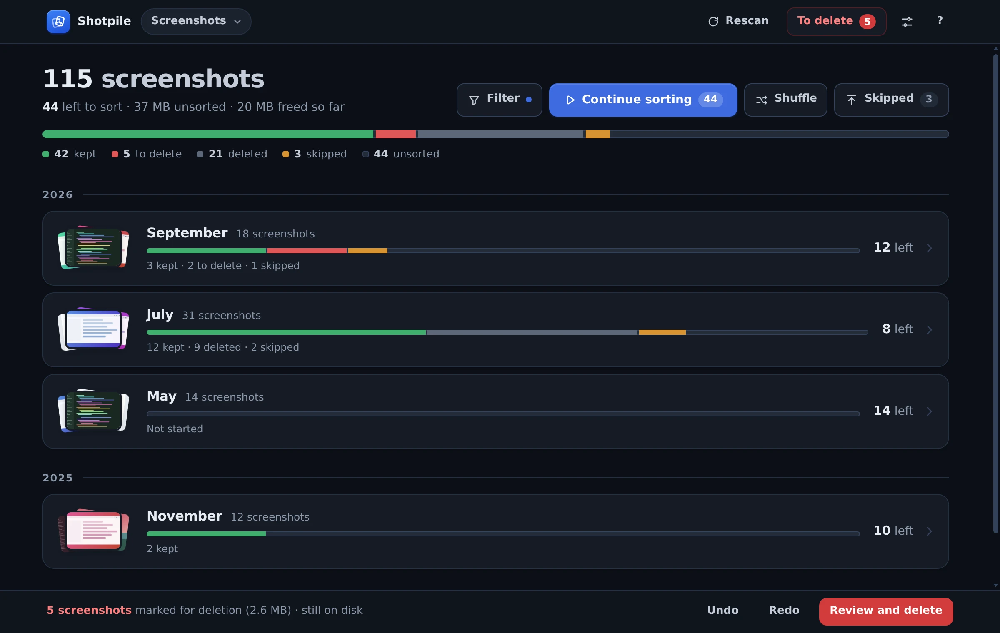

# Shotpile

A desktop app for clearing out a folder full of screenshots, on Windows, macOS
and Linux. It shows them one at a time, month by month: swipe left to mark one
for deletion, right to keep it, up to decide later. Marked files stay where
they are until you confirm, then go to the Recycle Bin (the Trash on macOS and
Linux), so a mistake can still be restored.

<p align="center">
  
</p>

It works entirely offline: no account, no network access, nothing uploaded.
[Download it](#download) to try it.

## A quick tour

**Pick a folder.** On first run it asks for the folder your screenshots pile
up in. A big folder is counted as it scans, so a first scan never looks stuck.


**See what is left.** The library shows the whole folder as one bar (kept,
marked for deletion, deleted, skipped, unsorted), then a row per month. Click
a month to sort it (months you have finished are hidden; *Filter* brings them
back), *Continue sorting* to go through everything unsorted,
newest first, or *Shuffle* to get the same in random order, which turns up
forgotten screenshots from years ago next to yesterday's. *Skipped* brings back
what you put off.


**Sort.** The screenshots come one at a time, on a deck. Drag the card right
to keep it, left to mark it for deletion, up to skip it for now, or use the
arrow keys. The card tints and stamps itself as you drag, so you can see what
will happen before you let go. Scroll to zoom in, `Space` opens the photo full
screen, `Z` undoes and `Y` redoes.


**Finish a month.** The end of a pass shows what you decided, how much space
the deletions would free, and offers the next month that still has work.


**Delete when you are ready.** Marked files wait on the *To delete* pile, still
on disk. Each one has a *Don't delete* button for anything you marked by
mistake, or you can check them one by one as cards. *Move to Recycle Bin* asks
once, with *Cancel* focused, so Enter never deletes by accident. Each folder
has its own pile.


**Light or dark.** It follows the system theme, or the choice in Options.



## Download

Get it from the
[latest release](https://github.com/SametHope/Shotpile/releases/latest).

| System | File |
| --- | --- |
| Windows 10/11, 64-bit | `Shotpile_<version>_x64-setup.exe` installs it for your user, with a Start menu entry and an uninstaller. `Shotpile_<version>_x64-portable.exe` runs as is. |
| macOS 10.15 or later, Apple silicon or Intel | `Shotpile_<version>_macos-universal.dmg` |
| Linux, x86_64 | `Shotpile_<version>_linux-x86_64.AppImage` runs on most distributions (`chmod +x` it first). `Shotpile_<version>_linux-amd64.deb` is for Debian and Ubuntu. |

The builds are not code-signed:

- **Windows**: SmartScreen may say *Windows protected your PC*. Choose
  **More info**, then **Run anyway**. The app needs Microsoft Edge WebView2,
  which current Windows already has; the installer fetches it if it is
  missing.
- **macOS**: the first open is blocked. Open **System Settings › Privacy &
  Security** and choose **Open Anyway**.

Windows is where the app is used and tested by hand. The Linux build passes
the same automated tests in CI. **The macOS build is untested**: it is built
from the same code, but nobody has run it on a Mac yet. Treat it as a preview
and report what breaks.

Version 1.0.0 (Windows only) was called *Screenshot Sifter*. If you update from
it, the first start moves its database over and your decisions carry on.

## Details

- **Dates** come from the best evidence available: a date in the filename
  (most screenshot tools write one), else the file's creation time, else its
  modified time.
- **Skipping** sends a card to the back of the pass, once. If it comes round
  again and you skip it again, it stays skipped and the pass moves on.
- **Undo and redo** (`Z` / `Y`, or `Ctrl+Z` / `Ctrl+Y` anywhere) bring a card
  back from the side it left, and throw it again. A file already in the
  Recycle Bin is never brought back. If you restore one from there yourself,
  the next scan of its folder counts it as kept.
- **The filmstrip** under the buttons shows the last few decisions and what is
  coming; click any of them to jump there.
- **Zoom.** Scroll or pinch on a touchpad to zoom the card around the cursor (up to 8×); once zoomed,
  a drag pans instead of deciding. The whole app zooms with `Ctrl` and `+`,
  `-`, `0` or `Ctrl` and the wheel, and the layout tightens up at 125% or 150%
  display scaling rather than cutting things off.
- **Several folders.** The folder name in the header switches between saved
  folders, adds another, or forgets one. Forgetting only removes it from the
  app's database; no file is touched.
- **Options** (the sliders button, or `Ctrl+,`): theme, zoom, where your data
  and logs live with buttons to open them, and the versions and licences.
- **Right-click** a card, a pile tile or a filmstrip thumbnail to open it, show
  it in the file manager, copy its path, or decide it; a month offers to sort it.
- `?` lists every shortcut.

### Keyboard

| Key | Action |
| --- | --- |
| `←` `→` `↑` | Delete (mark), keep, skip. Holding a key decides once. |
| `Z`, `Backspace`, `Ctrl+Z` | Undo. `Ctrl+Z` also works outside a review. |
| `Y`, `Ctrl+Y`, `Ctrl+Shift+Z` | Redo |
| `Ctrl` + `+` `-` `0` | Zoom the whole app; `Ctrl+,` opens Options (`Cmd` works for `Ctrl` on macOS) |
| `Space` | Open the current photo full screen (and close it again) |
| `+` `-` `0` | Zoom the card in, out, back to 100%. Arrows pan while zoomed. |
| `Esc` | Close the viewer or a dialog |
| `?` | Keyboard shortcuts |
| `F12` / `Ctrl+Shift+I` | Developer tools |
| `Ctrl+Shift+L` | Show the backend log |

## Building from source

You need:

- [Rust](https://rustup.rs) (on Windows with the MSVC toolchain).
- Node.js only for the Tauri CLI and the tests.
- The [Tauri prerequisites](https://v2.tauri.app/start/prerequisites/) for your
  system: WebView2 on Windows (preinstalled on current Windows), the Xcode
  command line tools on macOS, and on Linux `libwebkit2gtk-4.1-dev`,
  `libgtk-3-dev`, `librsvg2-dev` and `libayatana-appindicator3-dev`.

```powershell
npm install
npm run dev          # tauri dev
npm run build        # NSIS installer in src-tauri/target/release/bundle
npm run preview      # the UI in any browser, against an in-memory fake backend
npm run screenshots  # regenerate the pictures in this README
```

`npm run preview` serves the real `src/` with `tests/fake-backend.js` injected,
so the interface can be worked on without building Rust. Open `/?demo` for a
lived-in library of over a hundred screenshots, or `/` for the small fixture
the GUI test uses.

`npm run screenshots` drives that demo library in headless Chrome with real
mouse and key input and writes `docs/screenshots/`, including the animation at
the top (which needs ffmpeg on `PATH`).

### Releases

`.github/workflows/release.yml` builds the Windows installer and portable exe,
a universal macOS `.dmg`, and a Linux AppImage and `.deb`, each on its own
runner, and publishes them as one GitHub release. Start it either by pushing a
version tag:

```powershell
git tag v1.2.0
git push origin v1.2.0
```

or by hand from the Actions tab (*Release*, *Run workflow*): pick the branch
and enter the new tag, and it tags that branch's head. Either way the tag has
to match the version in `src-tauri/Cargo.toml`, the one place it is
written. A push that changes the workflow itself runs it as a dry run: it
builds everything and keeps the files as a run artifact, but publishes
nothing. Each release also carries `THIRD-PARTY-LICENSES.html`, generated by
[cargo-about](https://github.com/EmbarkStudios/cargo-about) from
`src-tauri/about.toml`.

## Diagnosing problems

Two logs, because a release build cannot always be attached to a debugger:

- **DevTools**: press `F12` or `Ctrl+Shift+I`. The frontend logs every command,
  view change, decision and error to the console via `src/log.js`. Type
  `__shotpileLog.dump()` in the console to print the recent history.
- **File log**: the backend appends to `logs/shotpile.log` in the data folder
  (see [Data](#data); dated lines, rotated at
  2 MiB, the previous file kept as `shotpile.log.old`). Frontend warnings and
  errors are forwarded there too, tagged `[ui:…]`, and panics are written there
  before the process exits. Press `Ctrl+Shift+L` to read the tail in the app.

Both are always on, including in release builds.

## Tests

```powershell
npm test                                  # both JS suites
npm run test:logic                        # 44 logic tests (node --test)
npm run test:gui                          # 230 GUI assertions in headless Chrome
cd src-tauri; cargo test                  # 71 unit + 4 end-to-end tests
cd src-tauri; cargo clippy --all-targets -- -D warnings
cd src-tauri; cargo fmt --check
```

`npm run test:gui` loads the real `src/index.html` and `src/app.js` in headless
Chrome or Chromium (set `CHROME=` if it is not found), with
`tests/fake-backend.js` standing in for the Rust commands, and drives it with
real browser key events. It covers what the Rust tests cannot: the rendered
deck, gestures (including two swipes in a row), the keyboard map, rollback of a
failed write, undo and redo, the confirmation dialog (Enter must not confirm), the
viewer, the folder menu, Options, right-click menus, the app zoom and the
theme.

CI (`.github/workflows/ci.yml`) runs the JS suites, and the Rust checks on both
Linux and Windows, on every push.

## Architecture

```
src/                  static frontend, no bundler, no runtime dependencies
  index.html          shell markup and the start-up splash
  boot.js             runs before the first paint: theme and zoom preferences
  style.css           design tokens (light + dark), then per-view rules
  app.js              views, review deck, gestures, keyboard, Tauri calls
  dom.js              element builder, toast, modal, confirm, popover menu
  viewer.js           full-screen photo viewer
  icons.js            the icon set, including the pile brand mark
  logic.js            pure helpers, ReviewQueue, PassTally (unit tested)
  log.js              leveled logger + ring buffer, forwards to the file log
src-tauri/src/
  commands.rs         the Tauri command surface
  db.rs               SQLite schema, queries, month grouping
  scan.rs             directory walk + filename date inference
  undo.rs             session undo/redo stack
  log.rs              file logger + panic hook
tests/
  logic.test.mjs      node --test
  gui-smoke.cjs       CDP driver, with serve.cjs, fake-backend.js, probes.js
tools/
  app-icon.svg        icon source: npx tauri icon tools/app-icon.svg
  screenshots.cjs     regenerates docs/screenshots/ from the demo library
```

### Why no plugins

The frontend calls `window.__TAURI__.core.invoke` and nothing else. Folder
picking, scanning, the database and the Recycle Bin are all this app's own Rust
commands, so the capability file grants `core:default` and nothing more. There
is no filesystem plugin scope to get wrong.

The one exception is the asset protocol, which is how a card displays an image
from an arbitrary folder. It is configured in `tauri.conf.json` rather than
through a plugin permission.

### Deletion model

| Status | Meaning | On disk |
| --- | --- | --- |
| `pending` | not decided | yes |
| `staged` | marked for deletion | **yes** |
| `kept` | keep | yes |
| `skipped` | revisit later | yes |
| `deleted` | sent to the Recycle Bin or Trash | no |

A rescan refreshes size, dates and the missing flag but never resets a
decision, so deleting a folder and restoring it later does not undo your work.
The one exception: a `deleted` file that is back on disk was restored from the
bin by hand, so the rescan marks it `kept`. Files that vanish from disk outside
the app are flagged missing and drop out of the review queues. Files the app
itself sent to the Recycle Bin are not "missing", so the freed-space figures
survive a rescan.

## Data

The database lives in the app data folder, which Options shows and opens:
`%APPDATA%\com.samethope.shotpile\` on Windows,
`~/Library/Application Support/com.samethope.shotpile/` on macOS and
`~/.local/share/com.samethope.shotpile/` on Linux.

- `shotpile.db`: SQLite, WAL mode. (1.0.0 kept it as `sifter.db` under
  `com.hope.screenshotsifter`; the first start of a newer version moves it.)
- Tables: `roots`, `screenshots`, `staged`, `meta` (schema version).

To start over, close the app and delete that file, or forget a folder from the
folder menu.

## Supported formats

Previewable: `png`, `jpg`/`jpeg`, `jfif`, `webp`, `bmp`, `gif`, `avif`.

Tracked but not previewable, shown as a placeholder you can still decide on:
`heic`, `heif`, `tif`, `tiff`. Video files are ignored.

## Limitations

- Undo and redo are per session. Decisions survive a restart; the ability to
  walk them back does not.
- Thumbnails are the original images, scaled by the WebView; there is no
  thumbnail cache yet.
- On Windows, on a drive without a Recycle Bin (most network shares, some USB
  drives), Windows asks before deleting each file permanently; cancelling
  leaves it on the pile.

## License

[PolyForm Noncommercial 1.0.0](LICENSE). You may use, change and share
Shotpile for free for any noncommercial purpose, privately or inside an
organisation. You may not sell it, or use it or a modified version to make
money. Release 1.0.0 was published under MIT (as *Screenshot Sifter*), and
that copy stays MIT; everything after it is under PolyForm Noncommercial.

The app includes open-source components under their own permissive licences
(MIT, Apache-2.0 and similar); each release ships their full texts as
`THIRD-PARTY-LICENSES.html`.
