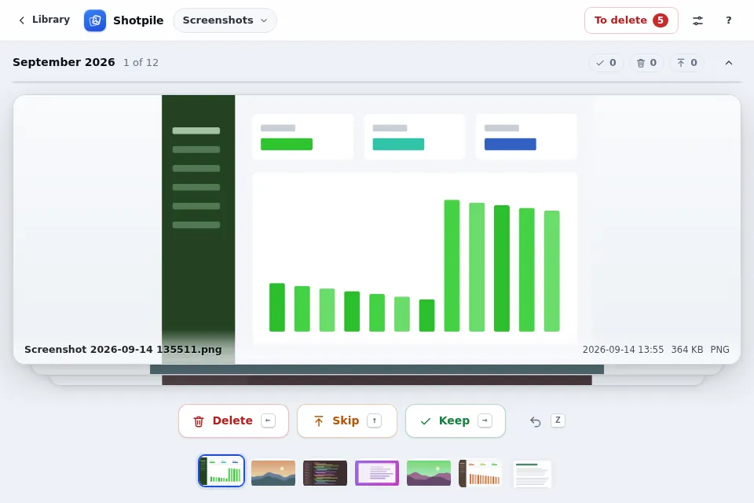
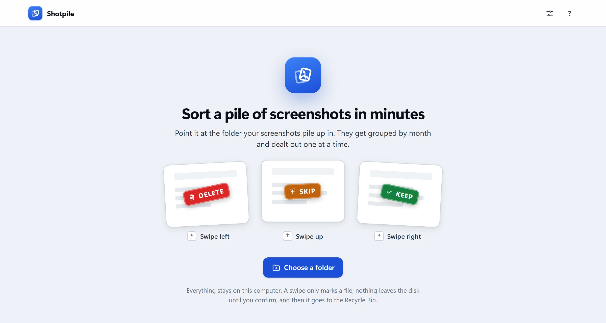
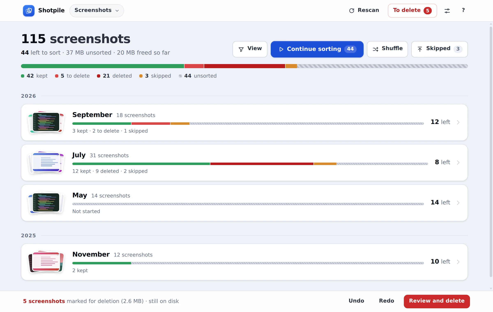
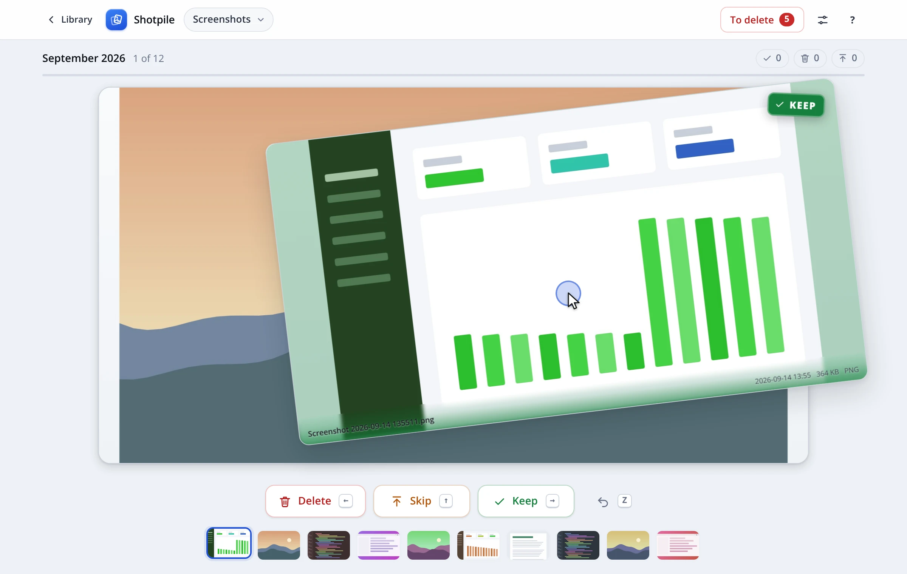
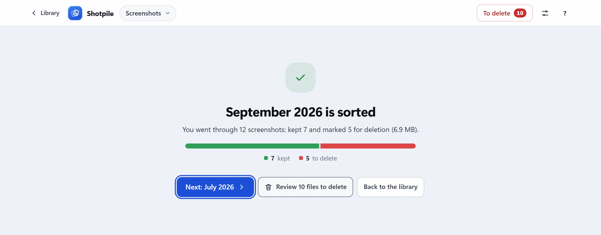
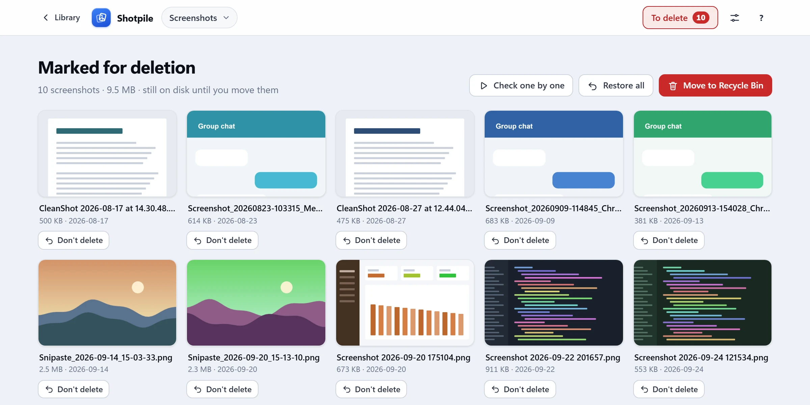
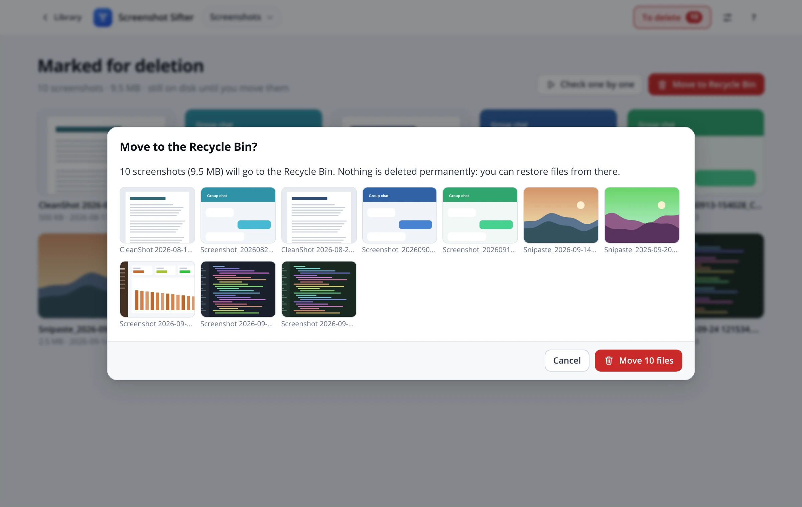
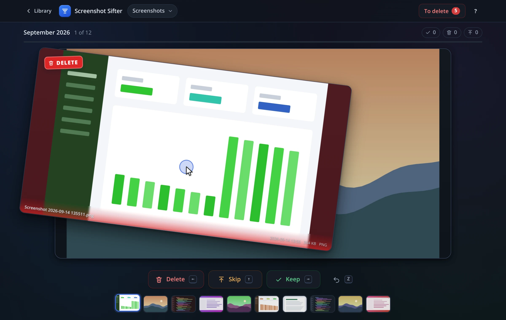

# Screenshot Sifter

Local-first desktop app for clearing out a folder of screenshots. It groups
them by month and deals them out one at a time: swipe left to delete, right to
keep, up to decide later. Nothing leaves the disk until you confirm, and then
it goes to the Windows Recycle Bin, not into the void.

<p align="center">
  
</p>

Nothing is uploaded. The database, the queue logic and every filesystem touch
live on the local machine.

## Download

Get the installer from the
[latest release](https://github.com/SametHope/Screenshot-Sifter/releases/latest)
(Windows 10 or 11, 64-bit):

- `Screenshot-Sifter_<version>_x64-setup.exe` installs it for your user, with a
  Start menu entry and an uninstaller.
- `Screenshot-Sifter_<version>_x64-portable.exe` runs as is, without
  installing.

The builds are not code-signed yet, so Windows SmartScreen may say *Windows
protected your PC*. Choose **More info**, then **Run anyway**. The app needs
Microsoft Edge WebView2, which current Windows already has; the installer
fetches it if it is missing.

## A quick tour

**Pick a folder.** On first run it asks for the folder your screenshots pile
up in. A big folder is counted as it scans, so a first scan never looks stuck.



**See what is left.** The library shows the whole folder as one bar (kept,
marked for deletion, deleted, skipped, unsorted), then a row per month. Click
a month to sort it, or *Continue sorting* to walk everything unsorted, newest
first.



**Sort.** The screenshots come one at a time, on a deck. Drag the card right
to keep it, left to mark it for deletion, up to skip it for now, or use the
arrow keys. The card tints and stamps itself as you drag, so you can see what
will happen before you let go. Scroll to zoom in, `Space` opens the photo full
screen, `Z` undoes.



**Finish a month.** The end of a pass shows what you decided, how much space
the deletions would free, and offers the next month that still has work.



**Delete for real, when you are ready.** Marked files wait on the *To delete*
pile, still on disk. Put back anything you marked by mistake, or check them
one by one.



*Move to Recycle Bin* shows every file once more and starts on *Cancel*, so
Enter never deletes by accident. The files go to the Windows Recycle Bin, so
you can still restore them from there.



**Light or dark.** It follows the Windows theme.



## How it works

- **Point it at a folder.** It scans the tree for images (counting them as it
  goes, so a big first scan never looks stuck) and dates each one from the best
  evidence it has: a date in the filename (most screenshot tools write one),
  else the file's creation time, else its modified time.
- **The library** shows how much is left at a glance: one stacked bar for the
  whole folder (kept, marked for deletion, deleted, skipped, unsorted), then a
  row per month, grouped by year, each with a small fan of its shots. *Continue
  sorting* walks everything unsorted, newest first; *Shuffle* does it in random
  order; *Skipped* revisits what you put off.
- **Sorting** happens on a deck of cards. Drag the top card, or use the arrow
  keys or the buttons; the card tints and stamps itself with the decision as
  you drag, and the next card is already sliding into place underneath. A key
  press throws the card the same way a swipe would, so the motion teaches the
  gesture. A pass keeps a running tally, and the filmstrip under the buttons
  shows the last few decisions and what is coming, so you can click back to any
  of them.
- **Skipping** sends a card to the back of the pass, once. If it comes round
  again and you skip it again, it stays skipped and the pass moves on.
- **Undo** (`Z`, `Ctrl+Z`, `Backspace`) brings a card back from the side it
  left. It walks back decisions only while they still apply: a file that is
  already in the Recycle Bin is never brought back as a live row. **Redo**
  (`Y`, `Ctrl+Y`, `Ctrl+Shift+Z`) throws an undone card again.
- **Looking closer.** Scroll to zoom the card around the cursor (up to 8×);
  once zoomed, a drag pans instead of deciding. `Space` or a click opens the
  photo full screen with the same zoom.
- **The end of a pass** shows what you decided, how much space the deletions
  would free, and offers the next month that still has work.
- **Deleting** is a separate step. Marked files collect on the *To delete*
  pile (the red badge in the header), shown as a grid you can open, check one
  by one, or *put back*. *Move to Recycle Bin* shows every file once more and
  starts with the focus on *Cancel*, so Enter never deletes by accident.
- **Several folders.** The folder name in the header switches between saved
  folders, adds another, or forgets one. Forgetting only removes it from the
  app's database; no file is touched.
- **Options** (the sliders button, or `Ctrl+,`) picks the theme (System,
  Light or Dark) and the app zoom, shows where your data and logs live with
  buttons to open them, and lists the versions and licences in an About
  section. Zoom also follows `Ctrl` with `+`, `-`, `0` or the mouse wheel, and
  is remembered; at 125% or 150% Windows scaling the layout tightens up rather
  than cutting things off.
- **Right-click** a card, a pile tile or a filmstrip thumbnail to open it, show
  it in File Explorer, copy its path, or decide it; a month offers to sort it.
- `?` lists every shortcut.

### Keyboard

| Key | Action |
| --- | --- |
| `←` `→` `↑` | Delete (mark), keep, skip. Holding a key decides once. |
| `Z`, `Backspace`, `Ctrl+Z` | Undo. `Ctrl+Z` also works outside a review. |
| `Y`, `Ctrl+Y`, `Ctrl+Shift+Z` | Redo |
| `Ctrl` + `+` `-` `0` | Zoom the whole app; `Ctrl+,` opens Options |
| `Space` | Open the current photo full screen (and close it again) |
| `+` `-` `0` | Zoom the card in, out, back to 100%. Arrows pan while zoomed. |
| `Esc` | Close the viewer or a dialog |
| `?` | Keyboard shortcuts |
| `F12` / `Ctrl+Shift+I` | Developer tools |
| `Ctrl+Shift+L` | Show the backend log |

## Building from source

You need:

- Windows 10/11 with WebView2 (preinstalled on current Windows).
- [Rust](https://rustup.rs) with the MSVC toolchain.
- Node.js only for the Tauri CLI and the tests.

Linux works for development and the test suites; it needs the usual Tauri
packages (`libwebkit2gtk-4.1-dev`, `libgtk-3-dev`, `librsvg2-dev`,
`libayatana-appindicator3-dev`).

```powershell
npm install
npm run dev          # tauri dev
npm run build        # NSIS installer in src-tauri/target/release/bundle
npm run preview      # the UI in any browser, against an in-memory fake backend
npm run screenshots  # regenerate the pictures in this README
```

`npm run preview` serves the real `src/` with `tests/fake-backend.js` injected,
so the interface can be worked on without building Rust. Open `/?demo` for a
lived-in library of over a hundred screenshots, or `/` for the small fixture
the GUI test uses.

`npm run screenshots` drives that demo library in headless Chrome with real
mouse and key input and writes `docs/screenshots/`, including the animation at
the top (which needs ffmpeg on `PATH`).

### Releases

`.github/workflows/release.yml` builds the installer and the portable exe on a
Windows runner and publishes them as a GitHub release. Start it either by
pushing a version tag:

```powershell
git tag v1.0.0
git push origin v1.0.0
```

or by hand from the Actions tab (*Release*, *Run workflow*): pick the branch
and enter the new tag, and it tags that branch's head. Either way the tag has
to match the version in `src-tauri/tauri.conf.json`. A push that changes the
workflow itself runs it as a dry run: it builds everything and keeps the files
as a run artifact, but publishes nothing.

## Diagnosing problems

Two logs, because a release build cannot always be attached to a debugger:

- **DevTools**: press `F12` or `Ctrl+Shift+I`. The frontend logs every command,
  view change, decision and error to the console via `src/log.js`. Type
  `__sifterLog.dump()` in the console to print the recent history.
- **File log**: the backend appends to
  `%APPDATA%\com.hope.screenshotsifter\logs\sifter.log` (dated lines, rotated at
  2 MiB, the previous file kept as `sifter.log.old`). Frontend warnings and
  errors are forwarded there too, tagged `[ui:…]`, and panics are written there
  before the process exits. Press `Ctrl+Shift+L` to read the tail in the app.

Both are always on, including in release builds.

## Tests

```powershell
npm test                                  # both JS suites
npm run test:logic                        # 44 logic tests (node --test)
npm run test:gui                          # 227 GUI assertions in headless Chrome
cd src-tauri; cargo test                  # 71 unit + 4 end-to-end tests
cd src-tauri; cargo clippy --all-targets -- -D warnings
cd src-tauri; cargo fmt --check
```

`npm run test:gui` loads the real `src/index.html` and `src/app.js` in headless
Chrome or Chromium (set `CHROME=` if it is not found), with
`tests/fake-backend.js` standing in for the Rust commands, and drives it with
real browser key events. It covers what the Rust tests cannot: the rendered
deck, gestures (including two swipes in a row), the keyboard map, rollback of a
failed write, undo, the confirmation dialog (Enter must not confirm), the
viewer, the folder menu and the dark theme.

CI (`.github/workflows/ci.yml`) runs the JS suites, and the Rust checks on both
Linux and Windows, on every push.

## Architecture

```
src/                  static frontend, no bundler, no runtime dependencies
  index.html          shell markup
  style.css           design tokens (light + dark), then per-view rules
  app.js              views, review deck, gestures, keyboard, Tauri calls
  dom.js              element builder, toast, modal, confirm, popover menu
  viewer.js           full-screen photo viewer
  icons.js            the icon set, including the sieve brand mark
  logic.js            pure helpers, ReviewQueue, PassTally (unit tested)
  log.js              leveled logger + ring buffer, forwards to the file log
src-tauri/src/
  commands.rs         the Tauri command surface
  db.rs               SQLite schema, queries, month grouping
  scan.rs             directory walk + filename date inference
  undo.rs             session undo stack
  log.rs              file logger + panic hook
tests/
  logic.test.mjs      node --test
  gui-smoke.cjs       CDP driver, with serve.cjs, fake-backend.js, probes.js
tools/
  app-icon.svg        icon source: npx tauri icon tools/app-icon.svg
  screenshots.cjs     regenerates docs/screenshots/ from the demo library
```

### Why no plugins

The frontend calls `window.__TAURI__.core.invoke` and nothing else. Folder
picking, scanning, the database and the Recycle Bin are all this app's own Rust
commands, so the capability file grants `core:default` and nothing more. There
is no filesystem plugin scope to get wrong.

The one exception is the asset protocol, which is how a card displays an image
from an arbitrary folder. It is configured in `tauri.conf.json` rather than
through a plugin permission.

### Deletion model

| Status | Meaning | On disk |
| --- | --- | --- |
| `pending` | not decided | yes |
| `staged` | marked for deletion | **yes** |
| `kept` | keep | yes |
| `skipped` | revisit later | yes |
| `deleted` | sent to Recycle Bin | no |

A rescan refreshes size, dates and the missing flag but never resets a
decision, so deleting a folder and restoring it later does not undo your work.
Files that vanish from disk outside the app are flagged missing and drop out of
the review queues; files the app itself sent to the Recycle Bin are not
"missing", so the freed-space figures survive a rescan.

## Data

The database lives in Tauri's app data directory
(`%APPDATA%\com.hope.screenshotsifter\`):

- `sifter.db`: SQLite, WAL mode.
- Tables: `roots`, `screenshots`, `staged`, `meta` (schema version).

To start over, close the app and delete that file, or forget a folder from the
folder menu.

## Supported formats

Previewable by WebView2: `png`, `jpg`/`jpeg`, `jfif`, `webp`, `bmp`, `gif`, `avif`.

Tracked but not previewable, shown as a placeholder you can still decide on:
`heic`, `heif`, `tif`, `tiff`. Video files are ignored.

## Limitations

- Undo is per session. Decisions survive a restart; the ability to walk them
  back does not.
- Staging and the Recycle Bin commit are global across every saved folder,
  while the library is per folder.
- Thumbnails are the original images, scaled by the WebView; there is no
  thumbnail cache yet.
- A file restored from the Recycle Bin stays `deleted` in the database, since a
  rescan never changes a decision.
- On a drive without a Recycle Bin (most network shares, some USB drives),
  Windows asks before deleting each file permanently; cancelling leaves it on
  the pile.

## License

MIT. See [LICENSE](LICENSE).
